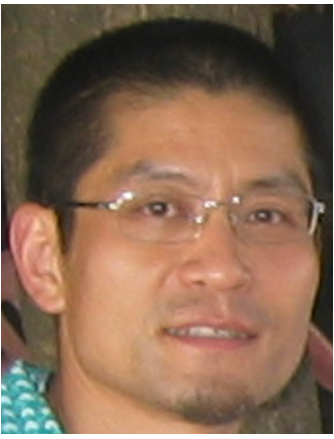

```{=html}
<div class="profile-hero">
  <div class="profile-photo-wrap">
    
    <div class="profile-photo-placeholder">GC</div>
  </div>
  <div class="profile-text">
    <h1 class="profile-name">Gary Chang</h1>
    <p class="profile-title">Data/GIS Scientist, Researcher, Systems Engineer</p>
    <p class="profile-affiliation">University of Texas at Dallas</p>
    <div class="profile-links">
      <a href="mailto:gxc180016@utdallas.edu" class="profile-link">✉ Email</a>
      <a href="cv/cv.pdf" class="profile-link" target="_blank">↗ CV</a>
    </div>
  </div>
</div>
```

## About

I am a data and geospatial information scientist, researcher, and systems engineer with multidisciplinary expertise spanning data engineering, geospatial analytics, advanced statistical modeling, software development, and agentic AI systems. I design and integrate data-driven infrastructures across CRM, ERP, analytics, and AI-enabled platforms, building end-to-end workflows from data acquisition and engineering through machine learning, large language model (LLM) orchestration, automation, and decision support.

My work combines Bayesian inference (INLA), causal inference, survival analysis, and spatial-temporal modeling with modern AI engineering practices including agentic workflows, LLM APIs, retrieval-augmented pipelines, and AI-assisted development environments such as Cursor, LangGraph, and Claude Code. I work extensively with Python, R, PHP, Java, C++, SQL, and ArcGIS Pro to transform heterogeneous, large-scale data into operational intelligence and decision-ready systems.

I bridge technical infrastructure, quantitative modeling, and AI automation, connecting raw data, analytical reasoning, and intelligent workflows into scalable research and operational solutions.

## Educations ##

- University of Texas at Dallas:<br> 
Ph.D., Political Science<br>
M.S., Geospatial Information Science<br>
M.S., Social Data Analytics and Research<br>

- Ohio State University:<br>
M.S., Computer Engineering<br>

- San Francisco State University:<br>
M.B.A.

## Skills

- Programming & Data: Python · R · Stata · PHP · Java · C++/C#/C

- Machine Learning: Agentic AI · Deep Learning · LLMs · YOLO/RoboFlow · RF/SVM/KNN, etc

- Geospatial: ArcGIS Pro · Classification/Detection · Remote Sensing · Suitability Analysis

- Statistical Methods: Bayesian/INLA · Survival Analysis · Causal Inference (DID, RDD, PSM, 2SLS) · OLS/GLM/GLMM · PCA/FA/Ridge/Lasso

- Databases & Systems: MySQL · PostgreSQL · MongoDB · Data Modeling · CRM/SFA/ERP · System Integration

- Analytics: Data Engineering · Tableau · Power BI
